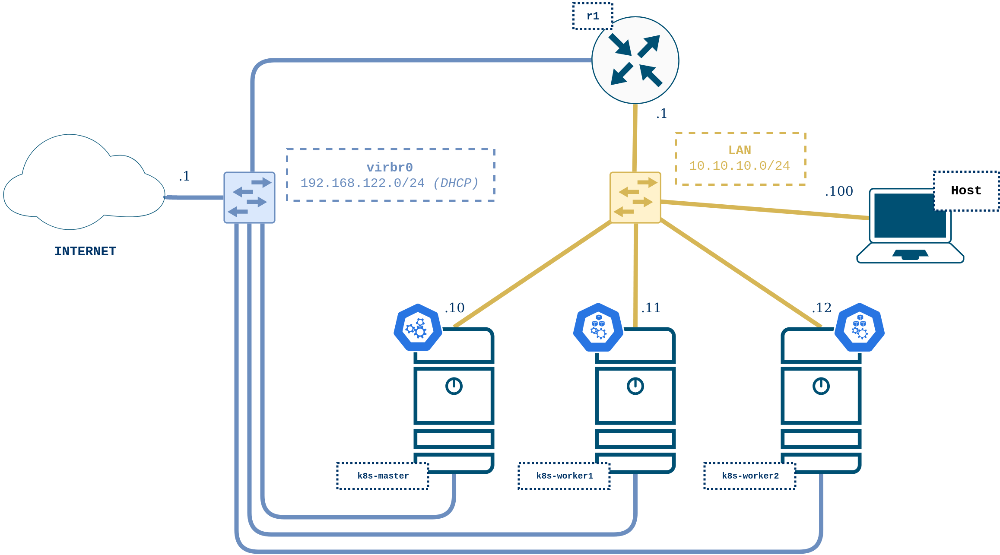

# k8s_lab

VNX kubespray scenario using consolidated virtual machine images with Kubernetes already installed (no need to run kubespray playbook)

## Scenario topology



K8s nodes are deployed as KVM virtual machines whereas r1 and h1 are LXC containers. They all run Ubuntu LTS 18.04.

## Requirements

- Baremetal Linux OS (_Tested on Ubuntu LTS 18.04_)
- VNX software -> [VNX Installation Recipe](https://web.dit.upm.es/vnxwiki/index.php/Vnx-install)
- Internet connection
- Hardware requirments: minimum 4GB RAM and 4 CPU cores

## Installation

Get and unpack VNX scenario:

```bash
wget http://idefix.dit.upm.es/download/vnx/examples/k8s/k8s_lab-v01.tgz
sudo vnx --unpack k8s_lab-v01.tgz
```

## Starting the scenario

Start it with:

```bash
cd k8s_lab-v01
sudo vnx -f k8s_lab.xml --create
```

The cluster starts only with the master node. To add the two worker nodes:

```bash
sudo vnx -f k8s_lab.xml -x add-worker1,add-worker2
```

Alternatively, you can add the nodes manually. For example, to add worker1, go to a k8s-master root shell:

```bash
JOINCMD=$(kubeadm token create --print-join-command | sed 's/127.0.0.1/10.10.10.10/')
ssh 10.10.10.11 "$JOINCMD"
```

## Creation recipe

Download vnx-kubespray:

```bash
git clone https://github.com/giros-dit/vnx-kubespray.git
```

Install ansible requirements:

```bash
cd tutorial_kubespray/ansible/kubespray
sudo pip3 install -r requirements.txt
```

Set correct private key permissions:

```bash
cd tutorial_kubespray/
chmod 600 conf/ssh/id_rsa
```

Start the VNX scenario:

```bash
sudo vnx -f tutorial_kubespray.xml -v --create
```

Check that you have connectivity with all systems without the password being requested:

```bash
ssh k8s-master
ssh k8s-worker1
ssh k8s-worker2
ssh r1
```

Run kubespray ansible playbook:

```bash
cd ansible
time ansible-playbook site.yml
```

Once the playbook has succesfully finished, check that the cluster is running correctly. For example, with this command you should see the three nodes being part of the cluster:
```bash
ssh k8s-master kubectl get nodes
```

Reset worker1 cluster config and eliminate both workers from the cluster in the master:

```bash
ssh k8s-worker1 kubeadm reset
ssh k8s-master kubectl delete node k8s-worker1
ssh k8s-master kubectl delete node k8s-worker2
```

Delete history in images with:

```bash
ssh k8s-master rm /root/.bash_history
ssh k8s-worker1 rm /root/.bash_history
```

Shutdown the scenario and create the new virtual machine images: 

```bash
cd ..
sudo vnx -f tutorial_kubespray.xml -v --shutdown

mkdir -p filesystems && cd filesystems

# master image
cp /usr/share/vnx/filesystems/vnx_rootfs_kvm_ubuntu64-18.04-v025.qcow2 vnx_rootfs_kvm_ubuntu64-18.04-v025-k8s-master.qcow2
VNXDIR=$( cat /etc/vnx.conf | grep -v ^# | grep vnx_dir | cut -d "=" -f 2 | sed -e "s,~,${HOME}," )
cp $VNXDIR/scenarios/tutorial_kubespray/vms/k8s-master/fs/root_cow_fs tmp-diff-master.qcow2
qemu-img rebase -b vnx_rootfs_kvm_ubuntu64-18.04-v025-k8s-master.qcow2 tmp-diff-master.qcow2
qemu-img commit tmp-diff-master.qcow2
rm tmp-diff-master.qcow2

# worker image
cp /usr/share/vnx/filesystems/vnx_rootfs_kvm_ubuntu64-18.04-v025.qcow2 vnx_rootfs_kvm_ubuntu64-18.04-v025-k8s-worker.qcow2
VNXDIR=$( cat /etc/vnx.conf | grep -v ^# | grep vnx_dir | cut -d "=" -f 2 | sed -e "s,~,${HOME}," )
cp $VNXDIR/scenarios/tutorial_kubespray/vms/k8s-worker1/fs/root_cow_fs tmp-diff-worker.qcow2
qemu-img rebase -b vnx_rootfs_kvm_ubuntu64-18.04-v025-k8s-worker.qcow2 tmp-diff-worker.qcow2
qemu-img commit tmp-diff-worker.qcow2
rm tmp-diff-worker.qcow2

# r1 image
VNXDIR=$( cat /etc/vnx.conf | grep -v ^# | grep vnx_dir | cut -d "=" -f 2 | sed -e "s,~,${HOME}," )
CONTROLLERDIR=${VNXDIR}/scenarios/tutorial_kubespray/vms/r1
pushd $CONTROLLERDIR
tmpfile=$(mktemp)
find mnt/ -type s > $tmpfile
ROOTFSNAME=vnx_rootfs_lxc_ubuntu64-18.04-v025-k8s
LANG=C tar --numeric-owner -cpf - mnt -X $tmpfile --transform "s|^mnt|${ROOTFSNAME}|" | gzip > ${ROOTFSNAME}.tgz
popd
mv $CONTROLLERDIR/${ROOTFSNAME}.tgz .
tar --numeric-owner -xzpf vnx_rootfs_lxc_ubuntu64-18.04-v025-k8s.tgz
ln -s  ${ROOTFSNAME} rootfs_k8s_r1
```
Release the scenario:
```bash
cd ..
sudo vnx -f tutorial_kubespray.xml --destroy
```

Now the images are on filesystems directory and the k8s_lab.xml VNX scenario is ready to be started.

You can create a VNX pack of the scenario with:

```bash
bin/pack-scenario-with-rootfs
```
